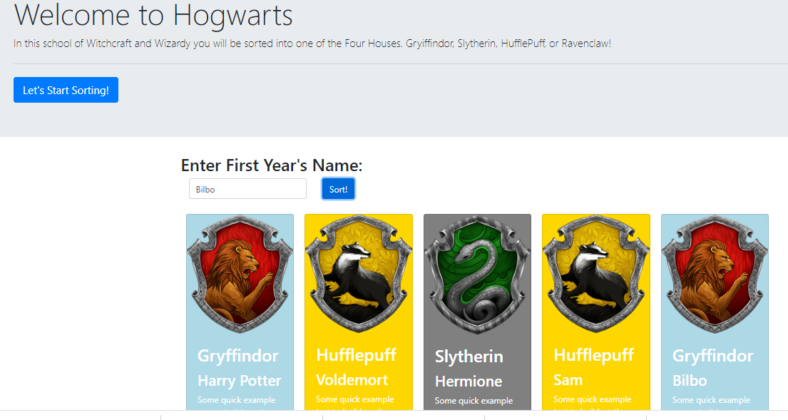

# Sorting Hat
This project was a group effort to simulate a way for new Hogwort's students to get assigned to a school.

## Motivation
The motivation behind thi project was mainly to assess how far we had come in our development skills. I contributed fixes to how it was printing to DOM (to make it print multiples), fixed expel function, minor fixes on other things, and added validation for null values and duplicates (and general cheerleading and brainstorming).

## Build status
MVP complete.

## Code Style
Vanilla Javascript ES6, HTML5, CSS3

## Screenshots



## URL

[https://awesome-pike-bfac13.netlify.app/](https://awesome-pike-bfac13.netlify.app/)

[](https://app.netlify.com/sites/awesome-pike-bfac13/deploys)

## Features
This site features a way to add students, assigns them to a random house, sorts them, and also provides a way to expell them

## Code Example
```

// THIS CAPTURES THE STUDENT INPUT
let studentInput = [];

const getStudentName = (e) => {
    e.preventDefault();

    let buttonId = e.target.id;
    if (buttonId === "sort-button") {
        const name = document.querySelector("#FormInput").value;

        //Below is Some validation:
        const found = studentInput.some(el => el.studentName === name);
        if (name != "" && !found) {
            let studentObject = { studentName: name, house: randomizer() };
            document.querySelector("#FormInput").value = "";
            studentInput.push(studentObject);

        } else {
            let validation = `<div id="validation">
            Hi there and greetings! You have either entered a duplicate or tried to enter nothing. Neither will do!
            </div>`;
            let inputDiv = document.getElementById('validationDiv');

            inputDiv.innerHTML = validation;
            setTimeout(function () {
                inputDiv.innerHTML = '';
            }, 2200);

        }

        houseCards();
    }
};

```
## Github owner

[Will Kotheimer](https://github.com/willkotheimer)


